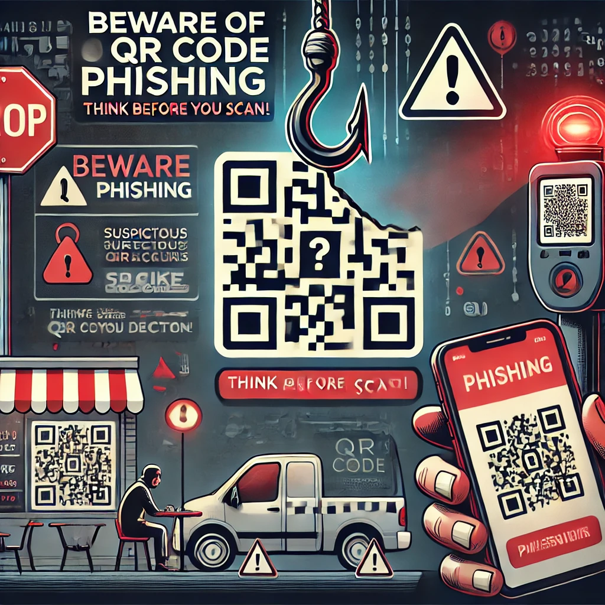

# Understanding QR Code Phishing: Risks and Prevention

  

Quick Response (QR) codes have become ubiquitous, offering a convenient bridge between the physical and digital worlds. They are used for various purposes, from accessing restaurant menus to making payments. However, this convenience has also opened doors for cybercriminals to exploit QR codes for malicious activities, notably phishing attacks, commonly referred to as "quishing."

## What is QR Code Phishing?

QR code phishing, or "quishing," involves embedding malicious URLs within QR codes. When scanned, these codes can direct users to counterfeit websites designed to steal personal information, install malware, or conduct fraudulent transactions. Unlike traditional phishing methods that rely on deceptive emails or messages, quishing leverages the trust and convenience associated with QR codes to deceive users.

## How Attackers Exploit QR Codes

- **Embedding Malicious URLs**: Attackers create QR codes that, when scanned, lead to phishing websites mimicking legitimate services to harvest credentials or personal data.

- **Tampering with Legitimate QR Codes**: Cybercriminals may replace authentic QR codes in public places with their malicious versions. For instance, fake QR codes have been placed over legitimate ones on parking meters, leading users to fraudulent payment sites.

## Real-World Examples

- **Parking Meter Scams**: In cities like Austin, Texas, malicious QR codes were affixed to parking meters. Unsuspecting users who scanned these codes were directed to fraudulent websites that captured their payment information. [Example parking meter scams in Seattle](https://www.king5.com/article/news/verify/scams-verify/fake-qr-code-parking-meter-scams/536-3d7437f3-ef57-401a-89f9-19c2d1292f97)

- **Fake Package Deliveries**: Scammers send unsolicited packages containing QR codes. When scanned, these codes lead to phishing sites designed to steal personal and financial information. [Example brushing](https://www.cnet.com/personal-finance/got-a-package-on-your-doorstep-that-you-didnt-order-it-could-be-a-scam/)

## Potential Dangers of Scanning Unknown QR Codes

- **Data Theft**: Scanned QR codes can redirect users to fake login pages designed to harvest sensitive information, including usernames, passwords, and credit card details. [Example, Data Theft](https://www.theverge.com/2025/1/8/24338947/t-mobile-2021-data-breach-washington-ag-lawsuit)

- **Malware Installation**: Some QR codes can initiate the download of malicious software onto your device, compromising its security and granting attackers unauthorized access.

- **Financial Loss**: By directing users to fraudulent payment portals, attackers can siphon funds directly from victims. [Example, QR code scam leads to loss of 65k dollars](https://www.kiro7.com/news/local/use-caution-with-qr-codes-they-can-lead-you-right-scammer/2Y6ARAUHH5FQXIVZDZTFC5RADY/)

## How to Protect Yourself

- **Verify URLs**: After scanning a QR code, check the URL before clicking any links. Be cautious of URLs that appear suspicious or differ slightly from the legitimate domain.

- **Avoid Scanning Random QR Codes**: Refrain from scanning QR codes from unknown or untrusted sources, especially those found in unsolicited emails or messages.

- **Inspect Physical QR Codes**: Before scanning, ensure the QR code hasn't been tampered with or replaced. Look for signs of stickers or overlays on legitimate codes.

- **Use Built-in QR Scanners**: Utilize your device's native camera app to scan QR codes, as third-party scanner apps may pose security risks.

- **Be Skeptical of Requests for Personal Information**: Legitimate QR codes typically do not request sensitive information. If prompted, verify the source before proceeding.

## Conclusion

While QR codes offer convenience, it's crucial to remain vigilant and informed about the potential risks associated with their use. By understanding the tactics employed by cybercriminals and adopting preventive measures, you can protect yourself and others from QR code phishing attacks.
